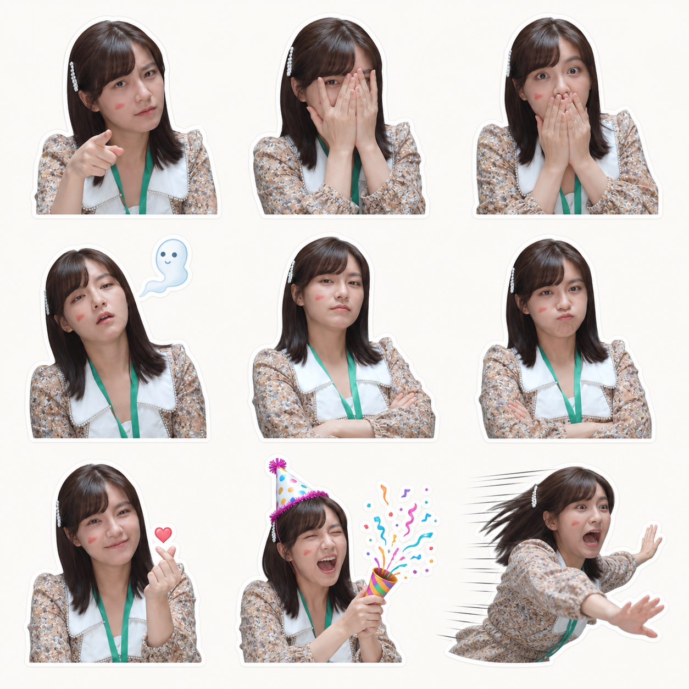
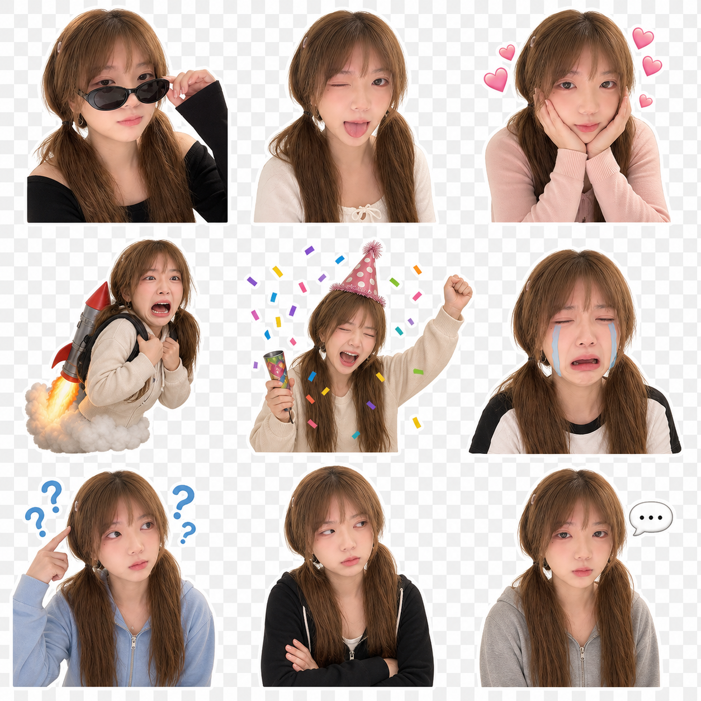
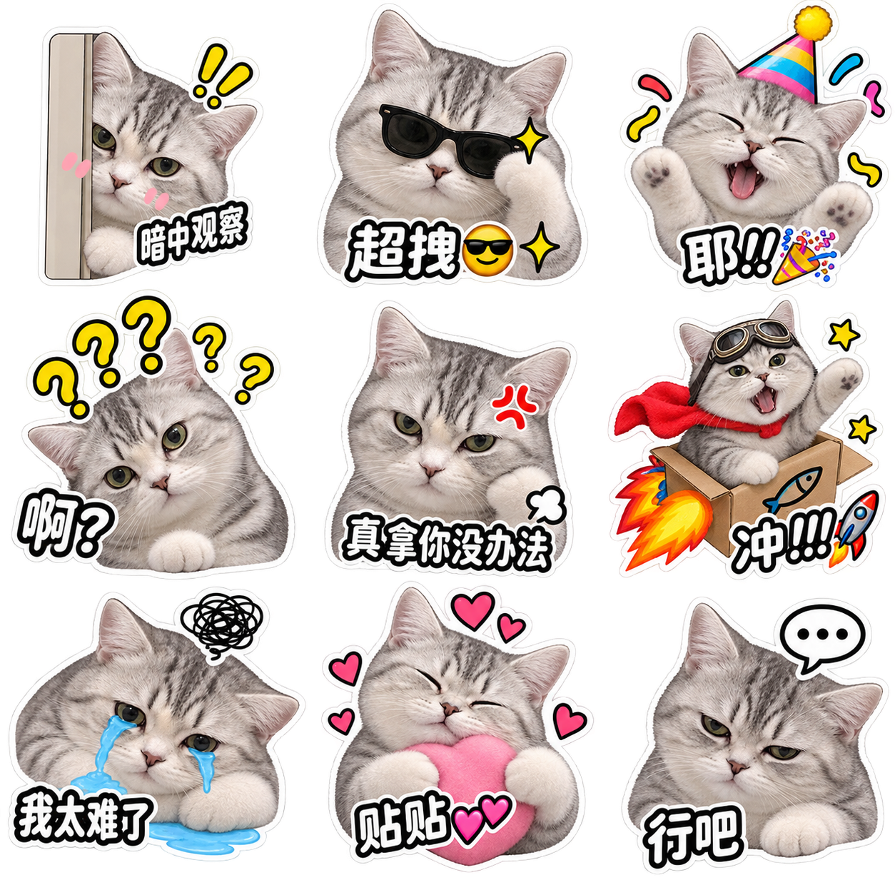

# Static Meme Sticker Pack

一个用于生成静态定制表情包的 Agent Skill。

上传人物、宠物或虚拟角色参考图，Skill 会从 84 种反应中随机抽取不重复组合，生成 2×2、3×3、4×4 表情包或独立透明 PNG。随机结果带 seed，可以重复生成同一套表情。

## 效果示例

### 人物表情包





### 宠物表情包



> 示例图片仅用于展示生成效果。使用真人、宠物、品牌或第三方角色参考图前，请确认自己拥有相应授权。

## 功能

- 内置 84 种静态表情，覆盖基础情绪、聊天、职场、游戏、情侣和节日场景
- 随机抽取且不重复，避免九张都是相似表情
- 支持 `2×2`、`3×3`、`4×4` 和独立贴纸
- 支持人物、宠物和虚拟角色参考图
- 尽量保持脸型、发型、肤色、毛色和角色辨识度
- 支持主题筛选和随机 seed 复现
- 支持可复现的自动中文配字
- 支持 `quick`、`standard`、`pro` 三档工作模式
- 支持透明 PNG 标准化、白色描边、Alpha 质检和自动拼图
- 支持微信、Telegram、WhatsApp、Discord 和通用尺寸预设
- 某一张失败时只返工该表情，不重做已确认内容

## 支持的主题

| 主题 | 适合场景 |
| --- | --- |
| `mixed` | 默认混合，情绪覆盖最丰富 |
| `cute` | 可爱、撒娇、害羞、呆萌 |
| `cool` | 墨镜、胜利、大佬感 |
| `sarcastic` | 侧眼、无语、礼貌鼓掌、扶额 |
| `dramatic` | 大哭、暴怒、震惊、逃跑 |
| `love` | 比心、飞吻、心动、心碎 |
| `celebration` | 彩纸、欢呼、派对、胜利 |
| `work` | 上班耗尽、咖啡续命、敬礼 |
| `chat` | 在吗、收到、催回复、沉默输入 |
| `gaming` | 求带飞、寄了、退游、胜利 |
| `festival` | 红包、生日、新年、假期结束 |

## 安装

克隆仓库：

```bash
git clone https://github.com/luotovo/static-meme-sticker-pack.git
```

将仓库中的 `static-meme-sticker-pack` 文件夹复制到你的 Agent Skill 目录。

Codex 默认位置：

```text
$CODEX_HOME/skills/static-meme-sticker-pack
```

如果使用其他支持 `SKILL.md` 的 Agent，也可以直接导入整个 `static-meme-sticker-pack` 文件夹。

## 快速使用

上传参考图后发送：

```text
使用 static-meme-sticker-pack。
用这张参考图生成3×3静态表情包，
从mixed表情库随机抽取，不要重复。
```

也可以指定主题：

```text
使用 static-meme-sticker-pack。
用参考图生成2×2宠物表情包，
主题选择sarcastic，输出一张预览图。
```

如果需要正式贴纸文件：

```text
使用 static-meme-sticker-pack。
随机生成9种不重复表情，
每种表情分别输出独立透明PNG，
最后再合成一张3×3预览图。
```

## 随机抽取表情

Skill 使用脚本完成真实随机选择，而不是让模型口头模拟随机。

```bash
python static-meme-sticker-pack/scripts/pick_expressions.py \
  --count 9 \
  --theme mixed
```

输出会包含本次随机 seed 和完整表情顺序。

使用相同 seed 可以复现同一套组合：

```bash
python static-meme-sticker-pack/scripts/pick_expressions.py \
  --count 9 \
  --theme mixed \
  --seed 7756822817661310282
```

输出纯文本列表：

```bash
python static-meme-sticker-pack/scripts/pick_expressions.py \
  --count 9 \
  --theme cute \
  --captions auto \
  --format text
```

## 三种生成模式

### `quick`

一次生成完整宫格，适合社交媒体发布和确认整体效果。速度较快，但单个表情不方便单独返工。

### `standard`

逐张生成独立贴纸，再合成预览页。适合交付和长期使用：

- 单张失败可以单独重做
- 人物身份和表情更容易控制
- 可以获得真正透明的 PNG
- 后续可以继续制作 GIF、WebP 或平台贴纸包

### `pro`

在标准模式基础上加入自动配字、统一白色描边、平台尺寸预设、Alpha 质检和输出清单。

独立透明 PNG 生成完毕后运行：

```bash
python static-meme-sticker-pack/scripts/build_pack.py \
  --input-dir input \
  --output-dir output \
  --platform wechat \
  --strict-alpha
```

输出结构：

```text
output/
├── preview.png
├── manifest.json
└── stickers/
    ├── 01-expression.png
    └── ...
```

## 表情库

完整表情定义位于：

```text
static-meme-sticker-pack/references/expression-library.json
```

每个表情包含：

- 唯一 ID
- 中文名称
- 情绪家族
- 可用主题
- 可视化动作提示词

你可以直接修改 JSON 增加自己的表情，只需确保 `id` 不重复。

## 目录结构

```text
static-meme-sticker-pack/
├── SKILL.md
├── agents/
│   └── openai.yaml
├── references/
│   ├── expression-library.json
│   ├── caption-library.json
│   └── prompt-template.md
└── scripts/
    ├── pick_expressions.py
    └── build_pack.py
```

## 注意事项

### 参考图要求

- 人物表情包需要清晰、完整的脸部参考，建议使用正脸或轻微侧脸、头部到胸口入镜的照片。
- 只有身体或服饰、脸部完全被裁掉的图片不能用于锁定人物身份；可以作为第二张服饰参考图使用。
- 避免严重模糊、强滤镜、五官遮挡、多人合照和过小的人脸。参考图越清晰，九张贴纸的一致性越好。
- 宠物参考图应能看清眼睛、耳朵、毛色和独特花纹；虚拟角色参考图应尽量展示完整配色与标志性服装。

### `quick` 与生产模式

- `quick` 一次生成完整宫格，速度快，适合测试风格和社交媒体预览，但它不是九张独立文件。
- `standard` 和 `pro` 会逐张生成，便于单独返工，也更容易保持尺寸、透明背景和人物一致性。
- 建议先用 `quick` 确认方向，再记录 seed 并切换到 `standard` 或 `pro`。
- 同一个 seed 能复现表情选择与自动配字，但生成模型仍可能产生不同的视觉细节。

### 透明背景与配字

- 白色背景或棋盘格图案不等于真实透明 PNG；正式交付前应检查 Alpha 通道。
- `build_pack.py --strict-alpha` 会报告无透明像素、主体贴边和非方形画布等问题，但不会自动完成复杂抠图。
- 中文配字建议在图片生成后由脚本叠加，避免模型生成乱码；短句通常控制在 6 个汉字以内。
- `build_pack.py` 需要 Pillow：`python -m pip install Pillow`。

### 生成质量与使用授权

- 生成模型无法保证每格五官、手指、服装和配饰完全一致；正式交付前应逐张检查。
- 发现多余人物、肢体错误、裁头、身份漂移或错误文字时，只返工失败的单张，不必重做整套。
- 使用真人照片前，请获得本人同意并确认肖像权、隐私权和公开发布范围。
- 本 Skill 不自动授予照片、角色、Logo、服装、字体或其他第三方素材的商业使用权。
- 平台尺寸与文件体积规则可能变化，正式上传微信、Telegram、WhatsApp 或 Discord 前应再次核对平台要求。

## License

[MIT License](LICENSE)
